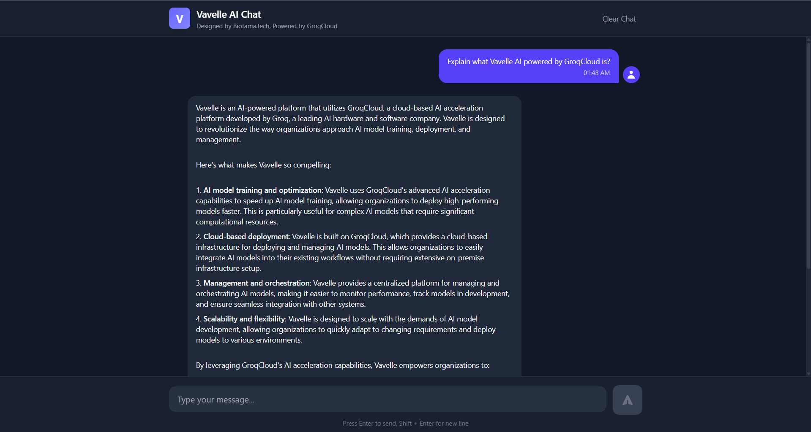

# Vavelle AI Chat Interface

A modern, responsive chat interface powered by GroqCloud and built with React. This application provides a seamless conversational experience with syntax highlighting for code blocks, markdown-like formatting, and a beautiful user interface.



## Features

- 💬 Real-time chat interface with AI responses
- 🎨 Beautiful, modern UI with dark mode
- 💻 Syntax highlighting for code blocks
- 📱 Fully responsive design
- 🔄 Conversation history retention
- ⚡ Fast responses powered by Groq AI
- 🎯 Error handling and user feedback
- 🎨 Markdown-like formatting support

## Prerequisites

Before you begin, ensure you have the following installed:
- Node.js (v16.0.0 or higher)
- npm (v7.0.0 or higher)
- A Groq API key

## Installation

1. Clone the repository:
```bash
git clone https://github.com/yourusername/vavelle-ai-chat.git
cd vavelle-ai-chat
```

2. Install dependencies:
```bash
npm install
```

3. Create a `.env` file in the root directory:
```env
VITE_GROQ=your_groq_api_key_here
```

4. Start the development server:
```bash
npm run dev
```

The application will be available at `http://localhost:5173`

## Deployment

### Deploy to Vercel

1. Push your code to a GitHub repository

2. Visit [Vercel](https://vercel.com) and sign in with GitHub

3. Click "New Project" and import your repository

4. Configure the project:
   - Framework Preset: Vite
   - Build Command: `npm run build`
   - Output Directory: `dist`
   
5. Add environment variables:
   - Add `VITE_GROQ` with your Groq API key

6. Click "Deploy"

### Deploy to Netlify

1. Push your code to a GitHub repository

2. Visit [Netlify](https://netlify.com) and sign in

3. Click "New site from Git" and connect your repository

4. Configure build settings:
   - Build Command: `npm run build`
   - Publish Directory: `dist`
   
5. Add environment variables:
   - Add `VITE_GROQ` with your Groq API key

6. Click "Deploy site"

### Deploy to GitHub Pages

1. Install the GitHub Pages package:
```bash
npm install gh-pages --save-dev
```

2. Add these scripts to your `package.json`:
```json
{
  "scripts": {
    "predeploy": "npm run build",
    "deploy": "gh-pages -d dist"
  }
}
```

3. Add homepage to `package.json`:
```json
{
  "homepage": "https://yourusername.github.io/vavelle-ai-chat"
}
```

4. Configure Vite for GitHub Pages by creating/updating `vite.config.js`:
```javascript
import { defineConfig } from 'vite'
import react from '@vitejs/plugin-react-swc'

export default defineConfig({
  plugins: [react()],
  base: '/vavelle-ai-chat/'
})
```

5. Deploy:
```bash
npm run deploy
```

### Deploy to Docker

1. Create a `Dockerfile` in the root directory:
```dockerfile
# Build stage
FROM node:18-alpine as build

WORKDIR /app
COPY package*.json ./
RUN npm install
COPY . .
RUN npm run build

# Production stage
FROM nginx:alpine
COPY --from=build /app/dist /usr/share/nginx/html
EXPOSE 80
CMD ["nginx", "-g", "daemon off;"]
```

2. Create a `.dockerignore` file:
```
node_modules
.env
dist
```

3. Build and run the Docker container:
```bash
docker build -t vavelle-ai-chat .
docker run -p 80:80 vavelle-ai-chat
```

## Configuration

### Environment Variables

| Variable | Description | Required |
|----------|-------------|----------|
| `VITE_GROQ` | Your Groq API key | Yes |

### Customization

You can customize the chat interface by modifying:

- `src/App.css` - Styling and theme
- `src/App.js` - Component structure and logic
- `src/utils/groq.js` - API integration

## Project Structure

```
vavelle-ai-chat/
├── src/
│   ├── App.css          # Application styles
│   ├── App.js           # Main chat component
│   ├── main.jsx         # Application entry point
│   └── utils/
│       └── groq.js      # Groq API integration
├── public/              # Static assets
├── .env                 # Environment variables
├── package.json         # Project dependencies
├── vite.config.js       # Vite configuration
└── README.md            # Documentation
```

## Development

### Available Scripts

- `npm run dev` - Start development server
- `npm run build` - Build for production
- `npm run preview` - Preview production build
- `npm run lint` - Run ESLint

### Code Style

This project uses ESLint for code quality. Run `npm run lint` to check for issues.

## Troubleshooting

### Common Issues

1. **API Key Issues**
   - Ensure your `.env` file is properly configured
   - Verify your Groq API key is valid
   - Check that the environment variable name matches `VITE_GROQ`

2. **Build Errors**
   - Clear npm cache: `npm cache clean --force`
   - Remove node_modules: `rm -rf node_modules`
   - Reinstall dependencies: `npm install`

3. **Deployment Issues**
   - Ensure all environment variables are set in your deployment platform
   - Check build logs for specific errors
   - Verify the correct build and output directories

## Contributing

1. Fork the repository
2. Create your feature branch (`git checkout -b feature/amazing-feature`)
3. Commit your changes (`git commit -m 'Add some amazing feature'`)
4. Push to the branch (`git push origin feature/amazing-feature`)
5. Open a Pull Request

## License

This project is licensed under the MIT License - see the [LICENSE](LICENSE) file for details.

## Acknowledgments

- Built with [React](https://reactjs.org/)
- Powered by [Groq AI](https://groq.com/)
- Styled with [Tailwind CSS](https://tailwindcss.com/)
- Syntax highlighting by [React Syntax Highlighter](https://github.com/react-syntax-highlighter/react-syntax-highlighter)

## Support

For support, please open an issue in the GitHub repository or contact the maintainers.

---

Made with ❤️ by [Biotama.tech](https://biotama.tech/)